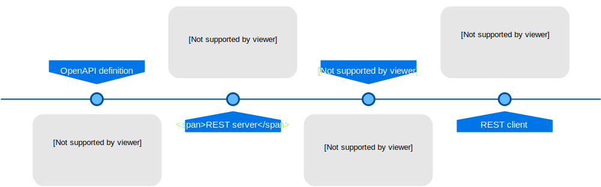

# OBA 

OBA project reads ontologies (OWL) and generates the OpenAPI Specification (OAS). Using this definition, it creates a REST API server automatically. Optionally, OBA can query an RDF endpoint using [OBA_sparql: A Python module based on GRLC to execute queries](https://github.com/knowledgeCaptureAndDiscovery/oba_sparql)

 

## Tools

### OpenAPI

The OpenAPI Specification (OAS) defines a standard, language-agnostic interface to RESTful APIs which allows **both humans and computers to discover and understand** the capabilities of the service without access to source code, documentation, or through network traffic inspection. When properly defined, a consumer can understand and interact with the remote service with a minimal amount of implementation logic.
More information at [OpenAPI Specification | Swagger](https://swagger.io/specification/)

### OWL

The W3C Web Ontology Language (OWL) is a Semantic Web language designed to represent rich and complex knowledge about things, groups of things, and relations between things. OWL is a computational logic-based language such that knowledge expressed in **OWL can be exploited by computer programs**, e.g., to verify the consistency of that knowledge or to make implicit knowledge explicit. OWL documents, known as ontologies, can be published in the World Wide Web 

## Features
- [x] Generate an OpenAPI specification from multiple ontologies (OWL).
    - [x] Convert to OWL Classes to OpenAPI schemas.
    - [x] Create paths (GET, POST, DELETE, PUT) for each schema.
    - [x] Read an OpenAPI base file with the description, documentation and servers of the API.
- [x] Generate a Python server ready to use:
    - [x] Use [OpenAPITools/openapi-generator](https://github.com/OpenAPITools/openapi-generator/) to generate the Python server.
    - [x] Automatically, generate the controller code (methods) using [Mustache Template](https://github.com/OpenAPITools/openapi-generator/wiki/Mustache-Template-Variables)
    - [x] Use authentication using Firebase. 
       - The user can read any graph.
       - The user can write his/her graph.
    - [x] Run the queries (these are SPARQL queries are autogenerated):
       - [x] Get a resource from any graph (e.g., `GET /models/id`)
       - [x] Get all the resources with a specified type from any graph. (e.g., `GET /models`)
       - [x] Delete a resource from his/her graph. (e.g., `DELETE /models/id`)
       - [x] Create (POST) a resource from his/her graph. (e.g., `POST /models`)
       - [x] Update (PUT) a resource from his/her graph. (e.g., `PUT /models/id`)
       - [ ] Get a resource related to another resource from any graph (e.g., `GET /models/id/parameters`)
     - [x] Obtain the results from the endpoint as JSON or JSON/LD.
- [x] Selected the paths to be created
    