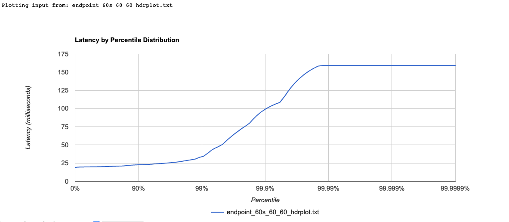

In this test, we evaluate three ways to obtain 100 resources from a endpoint,

Methods:

1. Using API generated by OBA (python) using pagination.
2. Using API generated by OBA (python) using pagination and Reverse Proxy with caching enabled (NGINX).
3. Sending the SPARQL query to endpoint.


### Summary

!!! TLDR
    We recommend to use Reverse Proxy with Caching cache in production.

If you use a Reverse Proxy with Caching, you can use OBA to production environment. We recommend to use NGINX and follow the guide [NGINX Content Caching](https://docs.nginx.com/nginx/admin-guide/content-cache/content-caching/)

The following figures show the latency by percentile distribution in a test scenario, the client sent 60 requests per second over 60 seconds.


**Figure 1**: 60 requests per second using Reverse Proxy with Caching


**Figure 2**: 60 requests per second to the endpoint

We concluded the latencies are similar in the 99.9% of the requests.

### Tests

Rate (number of request per second): 5, 10, 60


#### Rate 5 rq/sec

##### Reverse Proxy with caching disabled

```
Requests      [total, rate, throughput]         300, 5.02, 5.00
Duration      [total, attack, wait]             59.968s, 59.8s, 168.373ms
Latencies     [min, mean, 50, 90, 95, 99, max]  162.708ms, 172.199ms, 167.086ms, 200.934ms, 203.843ms, 207.774ms, 238.92ms
Bytes In      [total, mean]                     20211300, 67371.00
Bytes Out     [total, mean]                     0, 0.00
Success       [ratio]                           100.00%
Status Codes  [code:count]                      200:300  
Error Set:
```

```
Bucket           #    %      
[0s,     100ms]  0    0.00%
[100ms,  200ms]  266  88.67%  
[200ms,  300ms]  34   11.33%  
```

##### Reverse Proxy with caching enabled

```
Requests      [total, rate, throughput]         300, 5.02, 5.02
Duration      [total, attack, wait]             59.801s, 59.8s, 904.482µs
Latencies     [min, mean, 50, 90, 95, 99, max]  780.385µs, 1.079ms, 933.508µs, 1.179ms, 1.339ms, 1.591ms, 33.065ms
Bytes In      [total, mean]                     20211300, 67371.00
Bytes Out     [total, mean]                     0, 0.00
Success       [ratio]                           100.00%
Status Codes  [code:count]                      200:300  
Error Set:
```

```
Bucket           #    %        
[0s,     100ms]  300  100.00% 
[100ms,  200ms]  0    0.00%
```

##### Endpoint

```
Requests      [total, rate, throughput]         300, 5.02, 5.01
Duration      [total, attack, wait]             59.821s, 59.8s, 21.403ms
Latencies     [min, mean, 50, 90, 95, 99, max]  19.749ms, 22.187ms, 21.43ms, 24.774ms, 25.406ms, 29.059ms, 49.67ms
Bytes In      [total, mean]                     44750700, 149169.00
Bytes Out     [total, mean]                     166500, 555.00
Success       [ratio]                           100.00%
Status Codes  [code:count]                      200:300  
Error Set:

```

```
Bucket           #    %        
[0s,     100ms]  300  100.00%  
[100ms,  200ms]  0    0.00%
```

#### Rate 10 rq/sec

##### Reverse Proxy with caching disabled

```
Requests      [total, rate, throughput]         360, 6.00, 5.84
Duration      [total, attack, wait]             1m2s, 59.983s, 1.693s
Latencies     [min, mean, 50, 90, 95, 99, max]  172.402ms, 1.665s, 1.706s, 1.739s, 1.746s, 2.26s, 2.454s
Bytes In      [total, mean]                     24253560, 67371.00
Bytes Out     [total, mean]                     0, 0.00
Success       [ratio]                           100.00%
Status Codes  [code:count]                      200:360  
Error Set:
```

```
Bucket           #    %       
[0s,     100ms]  0    0.00%
[100ms,  200ms]  1    0.28%
[200ms,  300ms]  4    1.11%
[300ms,  400ms]  1    0.28%
[400ms,  500ms]  0    0.00%
[500ms,  600ms]  1    0.28%
[600ms,  700ms]  2    0.56%
[700ms,  800ms]  2    0.56%
[800ms,  900ms]  7    1.94%   
[900ms,  1s]     0    0.00%
[1s,     5s]     342  95.00% 
```

##### Reverse Proxy with caching enabled

```
Requests      [total, rate, throughput]         600, 10.02, 10.02
Duration      [total, attack, wait]             59.901s, 59.9s, 961.661µs
Latencies     [min, mean, 50, 90, 95, 99, max]  747.596µs, 1.352ms, 932.156µs, 1.216ms, 1.415ms, 1.592ms, 229.925ms
Bytes In      [total, mean]                     40422600, 67371.00
Bytes Out     [total, mean]                     0, 0.00
Success       [ratio]                           100.00%
Status Codes  [code:count]                      200:600
Error Set:
```

```
Bucket           #    %       
[0s,     100ms]  599  99.83% 
[100ms,  200ms]  0    0.00%
[200ms,  300ms]  1    0.17%
```

##### Endpoint


```
Requests      [total, rate, throughput]         600, 10.02, 10.01
Duration      [total, attack, wait]             59.924s, 59.9s, 23.678ms
Latencies     [min, mean, 50, 90, 95, 99, max]  19.588ms, 21.506ms, 20.95ms, 24.018ms, 24.498ms, 27.789ms, 52.641ms
Bytes In      [total, mean]                     89501400, 149169.00
Bytes Out     [total, mean]                     333000, 555.00
Success       [ratio]                           100.00%
Status Codes  [code:count]                      200:600  
Error Set:
```


```
Bucket           #    %       
[0s,     100ms]  300  100.00% 
[100ms,  200ms]  0    0.00%
```

#### Rate 60 rq/sec

##### Reverse Proxy with caching disabled

```
Requests      [total, rate, throughput]         410, 6.81, 5.82
Duration      [total, attack, wait]             1m10s, 1m0s, 10.301s
Latencies     [min, mean, 50, 90, 95, 99, max]  171.747ms, 9.492s, 10.303s, 10.338s, 10.366s, 12.338s, 15.508s
Bytes In      [total, mean]                     27622110, 67371.00
Bytes Out     [total, mean]                     0, 0.00
Success       [ratio]                           100.00%
Status Codes  [code:count]                      200:410
Error Set:

```


```
Bucket           #    %       
[0s,     100ms]  0    0.00%
[100ms,  200ms]  1    0.24%
[200ms,  300ms]  0    0.00%
[300ms,  400ms]  1    0.24%
[400ms,  500ms]  1    0.24%
[500ms,  600ms]  0    0.00%
[600ms,  700ms]  1    0.24%
[700ms,  800ms]  1    0.24%
[800ms,  900ms]  0    0.00%
[900ms,  1s]     1    0.24%
[1s,     5s]     25   6.10%   
[5s,     10s]    31   7.56%   
[10s,    +Inf]   348  84.88%  
```
##### Reverse Proxy with caching enabled


```
Requests      [total, rate, throughput]         3600, 60.02, 60.02
Duration      [total, attack, wait]             59.984s, 59.983s, 973.58µs
Latencies     [min, mean, 50, 90, 95, 99, max]  623.012µs, 994.68µs, 851.717µs, 1.17ms, 1.403ms, 1.684ms, 229.66ms
Bytes In      [total, mean]                     242535600, 67371.00
Bytes Out     [total, mean]                     0, 0.00
Success       [ratio]                           100.00%
Status Codes  [code:count]                      200:3600  
Error Set:
```

```
Bucket           #     %       
[0s,     100ms]  3599  99.89% 
[100ms,  200ms]  1     0.11%
```

##### Endpoint

```
Requests      [total, rate, throughput]         3600, 60.02, 60.00
Duration      [total, attack, wait]             1m0s, 59.983s, 21.179ms
Latencies     [min, mean, 50, 90, 95, 99, max]  19.106ms, 20.935ms, 19.966ms, 22.752ms, 24.167ms, 33.937ms, 159.216ms
Bytes In      [total, mean]                     537008400, 149169.00
Bytes Out     [total, mean]                     1998000, 555.00
Success       [ratio]                           100.00%
Status Codes  [code:count]                      200:3600
Error Set:

```

```
Bucket           #     %       
[0s,     100ms]  3596  99.89% 
[100ms,  200ms]  4     0.11%
```
